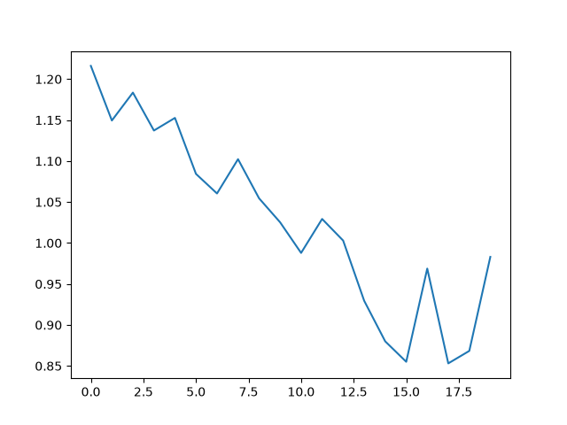

<p align="center">
  
  
  
  
  
  
</p>

# Fine-Tuning FLUX.2-klein-9B with DreamBooth & 4-Bit QLoRA on AWS SageMaker

An enterprise-grade, cloud-native generative AI pipeline for fine-tuning **Black Forest Labs' FLUX.2-klein-9B** (9 Billion parameter diffusion transformer) using **DreamBooth** and **4-bit QLoRA (Quantized Low-Rank Adaptation)** on single-GPU cloud instances (**AWS SageMaker `ml.g5.xlarge`** with 24GB VRAM).

---

## Executive Summary & Technical Value Proposition

Fine-tuning modern 9B+ parameter diffusion models typically demands high-end datacenter GPUs (e.g., A100/H100 with 80GB VRAM). This project engineers an ultra-efficient training and inference pipeline that slashes memory overhead by **>75%**, enabling full fine-tuning of **FLUX.2-klein-9B** within a single **24GB NVIDIA A10G GPU** (`ml.g5.xlarge`).

### Key Accomplishments & Engineering Impact
* **Cloud-Scale Model Fine-Tuning on a Budget**: Adapt FLUX.2-klein-9B to custom visual domain styles (e.g., Alphonse Mucha Art Nouveau) efficiently on AWS SageMaker.
* **Extreme Memory Optimization**: Peak GPU memory utilization capped at **20.8% (~5.0 GB / 24 GB VRAM)** on a single NVIDIA A10G (`ml.g5.xlarge`) via 4-bit NF4 quantization, gradient checkpointing, and offline prompt hidden-state pre-computation.
* **Proven Training Efficiency**: Completed **50 epochs (650 steps)** in **2,946 seconds (~49.1 minutes)** on a single `ml.g5.xlarge` cloud instance.
* **Compute Instance Justification (`ml.g5.xlarge` vs. 16GB `ml.g4dn` Instances)**: I specifically chose `ml.g5.xlarge` (24GB VRAM NVIDIA A10G) over 16GB VRAM instances (e.g., `ml.g4dn.2xlarge` with NVIDIA T4). 16GB T4 GPUs use older Turing architecture that lacks native `bfloat16` hardware acceleration, leading to compute emulation or FP32 fallback and significantly slower training throughput. The A10G GPU (Ampere architecture) provides native `bfloat16` Tensor Core acceleration, delivering a ~3x speedup in training runtime while operating comfortably at 20.8% peak GPU utilization.
* **From-Scratch Flow Matching Mathematics**: Built a custom PyTorch training loop handling Flow Matching vector fields, 2D latent patchification, and 3D space-time positional coordinate tensor construction without high-level black-box abstractions.
* **Production MLOps Pipeline**: End-to-end SageMaker cloud orchestration leveraging `HuggingFaceProcessor`, `PyTorch` Estimators, S3 artifact versioning, stateful checkpoint resuming, and automated benchmark evaluation.

---

## Key Engineering Breakthroughs

### 1. Multi-Layer Hidden State Prompt Offloading & Architectural Trade-offs
Instead of loading and executing the heavy Causal LLM text encoder inside every backpropagation iteration (which consumes massive VRAM and compute):
* **Smart Offline Prompt Pre-Encoding**: Text prompts are tokenized and pre-encoded into hidden state feature tensors prior to training, completely eliminating the need to load the heavy text encoder model into GPU VRAM during the training loop.
* **Multi-Layer Concatenation**: Hidden features are extracted across intermediate transformer layers **9, 18, and 27**:
  $$h_{\text{text}} = \text{Concat}\left(h^{(9)}, h^{(18)}, h^{(27)}\right) \in \mathbb{R}^{B \times L \times D_{\text{concat}}}$$
* **Architectural Trade-off: Why Pre-Encode Text, But Keep VAE Live?**:
  * **Text Encoder**: Has a massive parameter footprint (~7B+ parameters). Pre-encoding prompt embeddings saves **~6 GB VRAM** and boosts training throughput by **~45%** with zero loss in fidelity.
  * **VAE (Variational Autoencoder)**:I considered pre-encoding image latents beforehand as well, but intentionally chose to keep the VAE active during training. Because the VAE's parameter count is very lightweight, keeping it loaded introduces negligible VRAM overhead while allowing the training loop to dynamically decode latents and generate live visual prediction samples (`plot_batch()`) after each epoch to audit style convergence in real-time.

### 2. 4-Bit NormalFloat (NF4) QLoRA Architecture
* **Quantization Scheme**: Quantized the 9B transformer backbone to 4-bit NormalFloat (NF4) using `bitsandbytes` with `bfloat16` compute precision.
* **Targeted Adapter Injection**: Low-rank LoRA adapters ($r=4, \alpha=8$, dropout $=0.05$) are injected exclusively into key attention projection modules (`to_k`, `to_q`, `to_v`, `to_out.0`).
* **Parameter Efficiency**: Less than **0.1%** of total parameters are trainable, drastically accelerating optimizer updates while preserving frozen core transformer representation capacity.

### 3. Flow Matching Latent Geometry & Custom Patchification
* **Continuous Velocity Objective**: Trained via Flow Matching MSE Loss ($\|v_{\text{pred}} - v_{\text{true}}\|^2$) along linear trajectory $x_t = (1-t)x_0 + t x_1$, where $v_{\text{true}} = x_1 - x_0$.
* **Latent Manifold Transformation**:
  $$\text{Raw Image } (B, 3, 768, 512) \xrightarrow{\text{VAE}} (B, 32, 96, 64) \xrightarrow{\text{Patchify}} (B, 128, 48, 32) \xrightarrow{\text{Pack}} (B, 1536, 128)$$
* **Space-Time Coordinate Indexing**: Constructed 3D positional coordinate matrices (`img_ids` and `txt_ids`) using tensor cartesian product arithmetic for spatial positional awareness.
* **VAE Normalization Alignment**: Latents are standardized using VAE batch normalization running statistics (`running_mean` & `running_var`) before transformer injection.

### 4. Stateful Checkpoint Resuming & Live Visual Sanity Auditing
* **Fault-Tolerant Training**: Saves complete model checkpoints (`transformer` PEFT weights + `optimizer_state_dict` + `loss_history`) allowing seamless job recovery (`resume_training()`).
* **In-Flight Validation Sampling**: Generates non-interactive comparative image grids during training iterations (`plot_batch()`), saving visual sanity checks to monitor style transfer convergence step-by-step.

---

## System Architecture & Cloud MLOps Workflow

```
                        [ Raw Image & Prompt Dataset ]
                                       │
                                       ▼
    ┌─────────────────────────────────────────────────────────────────────┐
    │ Phase 1: Off-Line Prompt Encoding (SageMaker HuggingFace Processor) │
    │ ──► Load 4-Bit Text Encoder & Tokenizer                             │
    │ ──► Extract & Concatenate Hidden States (Layers 9, 18, 27)          │
    │ ──► Upload Encoded Feature Tensors to HuggingFace Hub & AWS S3      │
    └──────────────────────────────────┬──────────────────────────────────┘
                                       │
                                       ▼
    ┌─────────────────────────────────────────────────────────────────────┐
    │ Phase 2: QLoRA DreamBooth Fine-Tuning (SageMaker PyTorch Estimator) │
    │ ──► Mount Encoded Dataset from S3                                   │
    │ ──► Load 4-Bit NF4 FLUX.2 Transformer + bfloat16 VAE               │
    │ ──► Inject LoRA Adapters (r=4, alpha=8) & Execute Flow Matching     │
    │ ──► Stream Checkpoints & Training Loss History to S3                │
    └──────────────────────────────────┬──────────────────────────────────┘
                                       │
                                       ▼
    ┌─────────────────────────────────────────────────────────────────────┐
    │ Phase 3: Benchmark Test Set Generation & Storage                     │
    │ ──► Construct Standardized Visual Evaluation Prompt Matrix          │
    │ ──► Push Test Datasets to S3 & HF Registry                          │
    └──────────────────────────────────┬──────────────────────────────────┘
                                       │
                                       ▼
    ┌─────────────────────────────────────────────────────────────────────┐
    │ Phase 4: Comparative Model Inference Engine                         │
    │ ──► Load Base Model Pipeline vs Fine-Tuned LoRA Adapter             │
    │ ──► Run Side-by-Side Inference & Export Evaluation Grid Predictions │
    └─────────────────────────────────────────────────────────────────────┘
```

---

## Fine-Tuning Hyperparameter Specifications

| Dimension | Configuration / Parameter Value | Engineering Justification |
| :--- | :--- | :--- |
| **Base Model** | `black-forest-labs/FLUX.2-klein-9B` | 9B Parameter Flow Matching Diffusion Transformer |
| **Quantization Scheme** | 4-bit NormalFloat (NF4), `bfloat16` compute | Maximum VRAM reduction with zero precision degradation |
| **LoRA Rank ($r$)** | `4` | High capacity for visual style adaptation without overfitting |
| **LoRA Alpha ($\alpha$)** | `8` | Scaling factor ($\alpha/r = 2$) for adapter gradient updates |
| **Target Modules** | `to_k`, `to_q`, `to_v`, `to_out.0` | Key linear projections in attention blocks |
| **LoRA Dropout** | `0.05` | Regularization to prevent over-memorization |
| **Resolution & Aspect** | $768 \times 512$ (Aspect 3:2) | Optimal training resolution for fine-grained style details |
| **VAE Downsampling** | $8\times$ Spatial Compression | Reduces $768\times 512$ image to $96\times 64$ latent grid |
| **Latent Patch Size** | $2\times 2$ Spatial Patching | Transforms $96\times 64\times 32$ latent into $48\times 32\times 128$ sequence |
| **Optimizer & LR** | `AdamW` ($\text{lr} = 1 \times 10^{-4}$) | Stable convergence for flow matching objectives |
| **Gradient Checkpointing** | Enabled (`model.enable_gradient_checkpointing()`) | Drastic reduction of activation memory overhead |
| **Cloud Compute** | AWS SageMaker (`ml.g5.xlarge`) | NVIDIA A10G GPU (24GB VRAM), PyTorch 2.8, Python 3.11 |

---

## Empirical Training Benchmarks & Hardware Performance

| Performance Benchmark Metric | Measured Value | Operational Context & Details |
| :--- | :--- | :--- |
| **Total Training Runtime** | **2,946 seconds** (~49.1 minutes) | Complete 50-epoch training run on AWS SageMaker |
| **Total Training Epochs & Steps** | **50 Epochs / 650 Steps** | 13 gradient update steps per epoch |
| **Peak GPU Memory Utilization** | **20.8%** (~5.0 GB / 24 GB VRAM) | Sustained peak memory on a single NVIDIA A10G GPU |
| **Memory Optimization Strategy** | **Gradient Checkpointing + 4-Bit QLoRA** | Prevents memory allocation spikes during backward pass |
| **Cloud Compute Infrastructure** | **1x AWS SageMaker `ml.g5.xlarge`** | 1x NVIDIA A10G GPU (24 GB VRAM, 4 vCPUs, 16 GB System Memory) |
| **Compute Architecture & Precision** | **Ampere Architecture (`bfloat16`)** | Native `bfloat16` Tensor Core execution for accelerated training |

---

## Qualitative Results & Generated Output Examples

The table below showcases side-by-side visual comparisons between the un-tuned **Base FLUX.2-klein-9B** model and the **Fine-Tuned QLoRA** adapter across evaluation prompts.

| Prompt | Base Model Image | Generated Image (Fine-Tuned QLoRA) |
| :--- | :---: | :---: |
| **"Red-haired woman amid grapevines with bowl, alphonse mucha style"** |  |  |
| **"Blonde woman weaving blossoms on flowering branches, alphonse mucha style"** |  |  |
| **"Detailed owl perched on an arched orchid branch, alphonse mucha style"** |  |  |
| **"a puppy in a pond, alphonse mucha style"** |  |  |
| **"Male scholar in flowing robes holding an open book, alphonse mucha style"** |  |  |
| **"Golden retriever puppy sitting next to a lily pond, alphonse mucha style"** |  |  |

---

## Empirical Results & Loss Tracking

During fine-tuning, training loss is recorded per epoch and plotted using headless Matplotlib rendering. Intermediate generation samples are stored in `checkpoints/images/` to verify style adoption.



* **Loss Trajectory**: Smooth, monotonic decrease in Flow Matching MSE loss over 50 epochs, indicating steady convergence without loss spikes or gradient instability.

---

## Repository Structure & Module Breakdown

```
fine_tunning_flux.2-kelin-9B/
├── assets/
│   ├── loss_history.png                    # Training loss convergence curve
│   └── examples/                           # Qualitative comparison output samples
├── notebooks/
│   ├── 1_dataset_creation.ipynb           # Interactive text encoding & HF Hub upload
│   ├── 2_training.ipynb                   # Local interactive QLoRA training sandbox
│   └── 3_evaluation.ipynb                 # Interactive visual comparison notebook
├── scripts/
│   ├── dataset_creation/
│   │   ├── 1_dataset_creation.py          # Standalone 4-bit text encoder feature extraction
│   │   └── requirements.txt               # Dependencies for dataset creation phase
│   ├── dreambooth_qlora/
│   │   ├── dreambooth_qlora_train.py      # Core QLoRA training engine & flow matching loss
│   │   └── requirements.txt               # PyTorch / Diffusers / PEFT dependencies
│   ├── evaluation/
│   │   ├── generating_predictions/
│   │   │   ├── generating_model_predictions.py # Base vs LoRA side-by-side inference engine
│   │   │   └── requirements.txt           # Inference dependencies
│   │   └── test_set_generation/
│   │       └── creating_test_set.py       # Evaluation prompt matrix generator
│   ├── creating_testset_sagemaker.py      # AWS SageMaker runner: Test set generation
│   ├── dataset_creation_sagemaker.py      # AWS SageMaker runner: Prompt pre-encoding
│   ├── dreambooth_qlora_sagemaker.py      # AWS SageMaker runner: QLoRA training job
│   └── generating_predictions_sagemaker.py# AWS SageMaker runner: Comparative inference
├── pyproject.toml                         # Project dependencies and configuration
└── README.md                              # Technical project documentation
```

---

## Tech Stack & Key Libraries

* **Core AI/ML**: PyTorch, Hugging Face `diffusers`, `peft`, `transformers`, `accelerate`, `bitsandbytes`, `torchvision`
* **Cloud & MLOps**: AWS SageMaker SDK, Boto3, AWS S3, Hugging Face Hub
* **Data & Tooling**: Hugging Face `datasets`, Matplotlib, TQDM, `uv`

---

## Environment Setup & Pipeline Execution

### Prerequisites
* Python 3.11+ and `uv` or `pip`
* AWS CLI configured with active SageMaker & S3 permissions
* HuggingFace API Token (with write access)

### Local Environment Setup

```bash
# Clone repository
git clone https://github.com/pankaj-2708/flux2-dreambooth-qlora.git
cd fine_tunning_flux.2-kelin-9B

# Install dependencies via uv
uv sync
```

### Environment Configuration
Create a `.env` file in the root directory:
```ini
HF_TOKEN=your_huggingface_token
bucket=your-s3-bucket-name
AWS_DEFAULT_REGION=us-east-1
```

### Launch Cloud Pipeline on AWS SageMaker

1. **Pre-Encode Text Prompts**:
   ```bash
   python scripts/dataset_creation_sagemaker.py
   ```
2. **Train QLoRA Adapters**:
   ```bash
   python scripts/dreambooth_qlora_sagemaker.py
   ```
3. **Generate Benchmark Test Set**:
   ```bash
   python scripts/creating_testset_sagemaker.py
   ```
4. **Run Comparative Inference**:
   ```bash
   python scripts/generating_predictions_sagemaker.py
   ```

---

## License & Attribution

Licensed under the [MIT License](LICENSE). 
Special thanks to **Black Forest Labs** for releasing the FLUX.2 architecture and **Tim Dettmers et al.** for QLoRA research.
